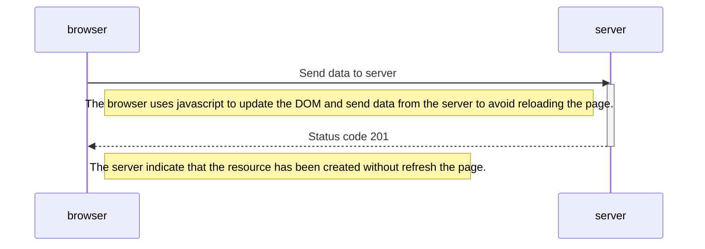

```mermaid
sequenceDiagram
    participant browser
    participant server

    browser->>server: Send data to server
    activate server

    Note right of browser: The browser uses javascript to update the DOM and send data from the server to avoid reloading the page.

    server-->>browser: Status code 201
    deactivate server

    Note right of browser:The server indicate that the resource has been created without refresh the page. 

  

```